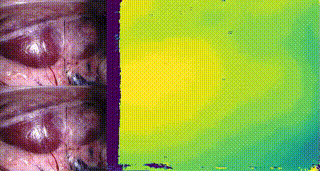
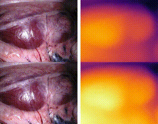

# Endoscopic STereo Transformer (EndoSTTR)

EndoSTTR is a stereo depth estimation model for medical endoscopic scenes using transformer.  It’s designed to handle the unique challenges of endoscopy and provide accurate depth predictions.

This project is based on the [STTR model](https://github.com/mli0603/stereo-transformer), with tweaks and improvements for medical applications.

Predicted disparity on SCARED endoscopic scene:



Predicted depth on SCARED endoscopic scene:



## Dependencies
- Create your python virtual environment by 
    ``` sh
    conda create --name sttr python=3.6 # create a virtual environment called "sttr" with python version 3.6
    ```
    (Python version >= 3.6)
- **Install Pytorch**: Please follow link [here](https://pytorch.org/get-started/locally/).

     (PyTorch version >= 1.5.1)
  
- **Other third-party packages**: You can use pip to install the dependencies by 
    ```sh
    pip install -r requirements.txt
    ``` 

## Folder Structure
 
#### Data Structure
Please see sample_scared folder for corresponding structure of the SCARED dataset. If you need to modify the existing structure, make sure to modify the dataloader.

SCARED
```
SCARED
    |_ dataset_x
        |_ keyframe_x
            |_ data
                |_ left_finalpass
                |_ right_finalpass
                |_ occl_left
                |_ disparity_left_pfm 
```

## Usage
#### Using Colab to inference
Under the scripts folder, you'll find the Inference.ipynb file which can be directly run on the colab.

#### Training on your own dataset
- In terminal, run training by
    ```
    sh scripts/train.sh
    ```
## License
This project is under the Apache 2.0 license. Please see [LICENSE](LICENSE) for more information.

## Acknowledgement
Special thanks to authors of [STTR](https://github.com/mli0603/stereo-transformer) for open-sourcing the code.
We also thank EndoVis for open-sourcing the [SCARED](https://endovis.grand-challenge.org/Endoscopic_Vision_Challenge) dataset.
